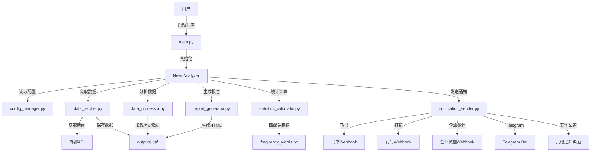
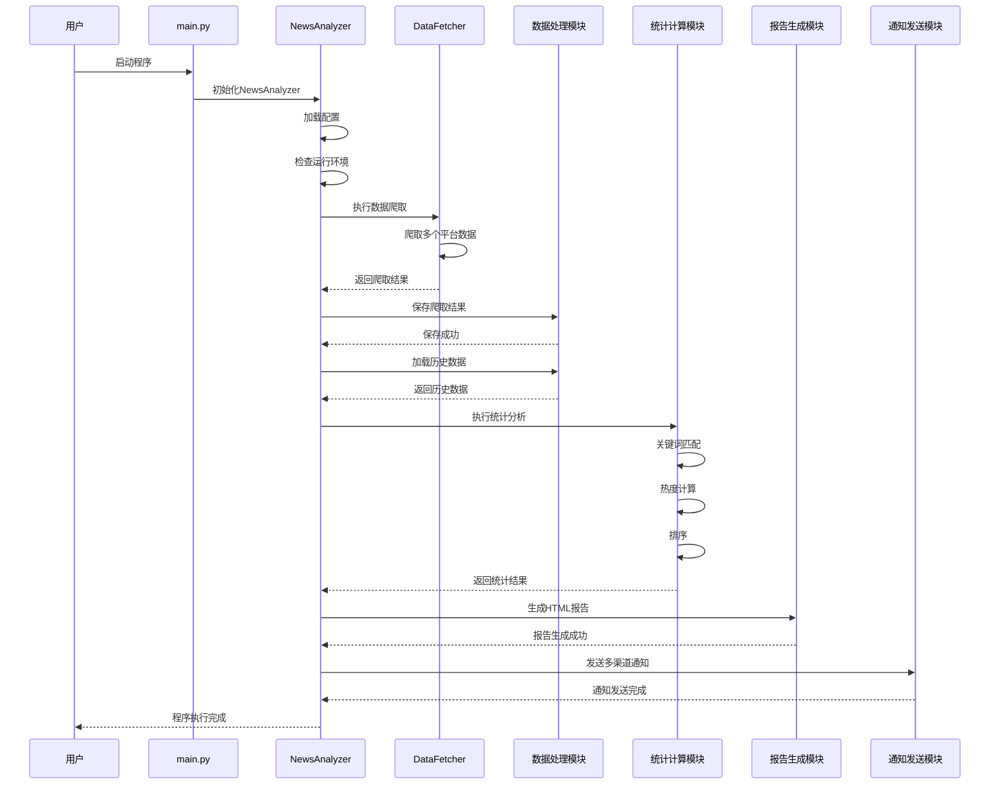

# TrendRadar 项目架构文档

## 1. 架构概述

TrendRadar 是一个新闻趋势分析系统，能够自动爬取多个新闻平台的标题，进行关键词匹配和热度分析，并生成可视化报告和多渠道通知。系统采用模块化设计，支持多种运行模式和灵活的配置，可部署在本地环境或 Docker 容器中。

### 核心功能

- 多平台新闻数据自动爬取
- 基于关键词组的新闻匹配
- 新闻热度计算和排序
- 多种格式报告生成（HTML、多渠道通知）
- 支持增量模式、当前榜单模式和当日汇总模式
- 多渠道通知（飞书、钉钉、企业微信、Telegram 等）

### 设计原则

- 模块化设计，各组件职责清晰
- 配置驱动，支持灵活调整
- 支持多种运行环境（本地、Docker、GitHub Actions）
- 易于扩展新的新闻平台和通知渠道

## 2. 目录结构

```
├── main.py                  # 程序主入口
├── src/                     # 主源码目录
│   ├── analyzer/            # 数据分析模块
│   │   ├── data_processor.py      # 数据处理
│   │   └── statistics_calculator.py # 统计计算
│   ├── config/              # 配置管理
│   │   └── config_manager.py      # 配置加载和验证
│   ├── crawler/             # 数据爬取模块
│   │   └── data_fetcher.py         # 新闻数据获取
│   ├── notifier/            # 通知模块
│   │   └── notification_sender.py # 多渠道通知发送
│   ├── reporter/            # 报告生成模块
│   │   └── report_generator.py    # HTML报告生成
│   ├── utils/               # 工具函数
│   │   ├── file_utils.py          # 文件操作
│   │   ├── push_record_manager.py # 推送记录管理
│   │   └── time_utils.py          # 时间处理
│   └── news_analyzer.py     # 核心分析器
├── config/                  # 配置文件
│   ├── config.yaml          # 主配置文件
│   └── frequency_words.txt  # 关键词组配置
├── output/                  # 输出目录
├── docker/                  # Docker相关配置
└── mcp_server/              # MCP服务器相关代码
```

### 核心目录说明

- **src/**：包含系统核心功能实现，采用模块化设计
- **config/**：存放系统配置文件，支持灵活调整
- **output/**：存储生成的报告和数据文件
- **docker/**：Docker 部署相关配置
- **mcp_server/**：MCP 服务器扩展功能

## 3. 核心功能模块

### 3.1 主程序入口 (main.py)

**功能**：程序启动点，初始化并运行 NewsAnalyzer 核心分析器。

**核心流程**：

1. 导入核心分析器类
2. 实例化 NewsAnalyzer 对象
3. 调用 run() 方法执行分析流程

**代码位置**：`main.py:7-23`

### 3.2 核心分析器 (news_analyzer.py)

**功能**：系统核心控制器，协调整个分析流程，包括数据爬取、分析、报告生成和通知发送。

**核心组件**：

- **NewsAnalyzer 类**：系统核心类，包含完整的分析流程
- **MODE_STRATEGIES**：定义三种运行模式的策略配置
  - 增量模式：只关注新增新闻，无新增时不推送
  - 当前榜单模式：关注当前时间点的榜单新闻
  - 当日汇总模式：汇总当日所有匹配新闻

**核心方法**：

- `run()`：主分析流程入口
- `_crawl_data()`：执行数据爬取
- `_run_analysis_pipeline()`：统一的分析流水线
- `_generate_summary_report()`：生成汇总报告
- `_send_notification_if_needed()`：统一的通知发送逻辑

**代码位置**：`src/news_analyzer.py:17-556`

### 3.3 配置管理 (config_manager.py)

**功能**：负责加载和验证系统配置，支持从配置文件和环境变量获取配置。

**核心功能**：

- 加载和解析 config.yaml 配置文件
- 支持环境变量优先级覆盖
- 多账号配置解析和验证
- 邮件 SMTP 配置自动匹配
- 配置缓存机制，避免重复加载

**代码位置**：`src/config/config_manager.py:147-391`

### 3.4 数据爬取 (data_fetcher.py)

**功能**：负责从多个新闻平台爬取最新的新闻标题数据。

**核心组件**：

- **DataFetcher 类**：数据爬取主类
- `fetch_data()`：单平台数据获取，支持重试机制
- `crawl_websites()`：多平台批量爬取

**技术特点**：

- 支持 HTTP 代理配置
- 自动重试机制，提高爬取成功率
- 随机请求间隔，避免被反爬
- 支持多种响应状态处理（最新数据、缓存数据）

**代码位置**：`src/crawler/data_fetcher.py:11-133`

### 3.5 数据分析模块

#### 3.5.1 数据处理 (data_processor.py)

**功能**：负责新闻标题的存储、加载和预处理。

**核心功能**：

- 新闻标题保存到文件
- 加载和解析历史标题数据
- 检测新增标题
- 加载和解析关键词组配置
- 支持按监控平台过滤数据

**代码位置**：`src/analyzer/data_processor.py:11-404`

#### 3.5.2 统计计算 (statistics_calculator.py)

**功能**：负责新闻热度计算、关键词匹配和统计分析。

**核心功能**：

- 新闻权重计算（基于排名、频次和热度）
- 关键词组匹配算法
- 新闻排序和过滤
- 排名格式化和显示

**技术特点**：

- 支持多种匹配策略
- 可配置的权重计算规则
- 支持全局过滤和词组内过滤
- 灵活的排序机制

**代码位置**：`src/analyzer/statistics_calculator.py:9-485`

### 3.6 报告生成 (report_generator.py)

**功能**：负责生成可视化的 HTML 报告。

**核心功能**：

- 准备报告数据
- 生成响应式 HTML 报告
- 支持多种报告模式（当日汇总、当前榜单、增量报告）
- 支持报告导出为图片

**技术特点**：

- 响应式设计，适配多种设备
- 美观的可视化界面
- 支持图片导出功能
- 可自定义报告标题和样式

**代码位置**：`src/reporter/report_generator.py:12-905`

### 3.7 通知发送 (notification_sender.py)

**功能**：负责将分析结果通过多种渠道发送通知。

**支持的通知渠道**：

- 飞书 Webhook
- 钉钉 Webhook
- 企业微信 Webhook
- Telegram Bot
- 邮件
- ntfy
- Bark
- Slack Webhook

**核心功能**：

- 多渠道通知发送
- 支持批量发送
- 适配不同平台的消息格式
- 推送时间窗口控制

**代码位置**：`src/notifier/notification_sender.py`

## 4. 系统架构图



## 5. 核心功能流程

### 5.1 完整执行流程



### 5.2 三种运行模式流程

#### 5.2.1 增量模式

1. 检查是否为当日第一次运行
2. 若是第一次运行：处理所有新闻，标记为新增
3. 若不是第一次运行：只处理新增新闻
4. 生成增量报告
5. 发送通知（仅当有新增匹配新闻时）

#### 5.2.2 当前榜单模式

1. 爬取最新数据
2. 筛选当前时间点的榜单新闻
3. 基于历史数据计算完整统计信息
4. 生成当前榜单报告
5. 发送实时通知

#### 5.2.3 当日汇总模式

1. 爬取最新数据
2. 加载当日所有历史数据
3. 执行完整的统计分析
4. 生成当日汇总报告
5. 发送汇总通知

## 6. 技术栈

| 类别     | 技术/框架                          | 用途           |
| -------- | ---------------------------------- | -------------- |
| 开发语言 | Python                             | 主要开发语言   |
| 网络请求 | requests                           | 数据爬取       |
| 配置管理 | PyYAML                             | 配置文件解析   |
| 报告生成 | HTML/CSS                           | 可视化报告     |
| 容器化   | Docker                             | 容器部署支持   |
| CI/CD    | GitHub Actions                     | 自动运行和部署 |
| 通知渠道 | 飞书、钉钉、企业微信、Telegram API | 多渠道通知发送 |

## 7. 部署方式

### 7.1 本地部署

1. 克隆代码仓库
2. 安装依赖：`pip install -r requirements.txt`
3. 配置 `config/config.yaml` 和 `config/frequency_words.txt`
4. 运行程序：`python main.py`

### 7.2 Docker 部署

1. 构建 Docker 镜像：`docker-compose -f docker/docker-compose-build.yml build`
2. 运行容器：`docker-compose -f docker/docker-compose.yml up -d`
3. 配置文件通过 Docker Volume 挂载：`config/` 目录挂载到容器内

### 7.3 GitHub Actions 部署

1. Fork 代码仓库
2. 配置 GitHub Secrets 存储通知渠道 Webhook 等敏感信息
3. 设置定时任务或手动触发工作流
4. 报告自动部署到 GitHub Pages

## 8. 配置说明

### 8.1 主要配置文件

#### config.yaml

- **app**：应用基本配置，如版本检查 URL
- **crawler**：爬虫配置，如请求间隔、代理设置
- **report**：报告配置，如报告模式、排名阈值
- **notification**：通知配置，包括各种渠道的 Webhook URL
- **weight**：权重配置，用于热度计算
- **platforms**：监控的新闻平台列表

#### frequency_words.txt

- 关键词组配置，支持以下语法：
  - 普通关键词：直接输入关键词
  - 必须包含词：`+关键词`
  - 过滤词：`!过滤词`
  - 最大显示数量：`@数字`
  - 全局过滤区：`[GLOBAL_FILTER]` 下的关键词会过滤所有新闻

### 8.2 环境变量支持

- 所有配置项均支持通过环境变量覆盖
- 环境变量命名规则：配置项名称转为大写，点号替换为下划线
- 例如：`CONFIG.crawler.request_interval` 对应环境变量 `CRAWLER_REQUEST_INTERVAL`

## 9. 监控与维护

### 9.1 日志输出

- 程序运行过程中会输出详细日志
- 日志包含：爬取状态、分析结果、报告生成状态、通知发送状态

### 9.2 常见问题排查

- 爬取失败：检查网络连接、代理设置、平台配置
- 报告无数据：检查关键词组配置、过滤词设置
- 通知发送失败：检查 Webhook URL 配置、网络连接

## 10. 扩展与开发

### 10.1 添加新的新闻平台

1. 在 `config.yaml` 的 `platforms` 列表中添加新平台配置
2. 确保平台 ID 与外部 API 兼容

### 10.2 添加新的通知渠道

1. 在 `notification_sender.py` 中添加新渠道的发送逻辑
2. 在配置文件中添加相应的配置项
3. 更新 `config_manager.py` 以支持新渠道的配置加载

### 10.3 自定义报告模板

1. 修改 `report_generator.py` 中的 HTML 模板
2. 调整 CSS 样式以满足自定义需求

## 11. 总结

TrendRadar 是一个功能完整、架构清晰的新闻趋势分析系统，具有良好的扩展性和灵活性。系统采用模块化设计，各组件职责明确，便于维护和扩展。支持多种运行模式和部署方式，能够适应不同场景的需求。

通过该系统，用户可以实时掌握多个新闻平台的热点趋势，及时获取关注领域的最新动态，为决策提供数据支持。系统的设计考虑了各种运行环境和使用场景，具有较高的实用性和可靠性。

## 12. 版本信息

| 版本  | 发布日期   | 主要变更     |
| ----- | ---------- | ------------ |
| 2.1.0 | 2025-12-11 | 当前最新版本 |

---

**文档生成时间**：2025-12-11
